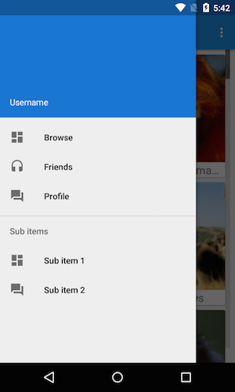

Xam.NavigationDrawer
================
Navigation Drawer sample implementations that you should be using in your Android applications :)

### Latest and greatest

Now featuring the Design Support Library and AppCompat with material design featuring the NavigationView!

Link: https://github.com/jamesmontemagno/Xam.NavDrawer/tree/master/Design%20Support%20Library%20(Material)/AppCompat%20v14%2B

Sample code showing Standard and MvvmCross implementation of the Navigation Drawer. Easy to implement with fragments to create a beautiful navigation scheme for your app. Also shows example of [ViewPagerIndicator](https://github.com/Cheesebaron/ViewPagerIndicator) which highlights the use of fragments inside of fragments.

Maintained by:
James Montemagno ([@JamesMontemagno](http://www.twitter.com/jamesmontemagno))

## Getting started
Blog post on: [MotzCod.es](http://motzcod.es/post/60427389481/effective-navigation-in-xamarin-android-part-1)

## Contributions/Thanks

[@Cheesebaron](http://github.com/cheesebaron) for:
[ViewPagerIndicator](https://github.com/Cheesebaron/ViewPagerIndicator)
[Drawer Sample](https://github.com/Cheesebaron/DrawerSample)

## License

   Copyright 2013 James Montemagno

    Licensed under the Apache License, Version 2.0 (the "License");
    you may not use this file except in compliance with the License.
    You may obtain a copy of the License at

       http://www.apache.org/licenses/LICENSE-2.0

    Unless required by applicable law or agreed to in writing, software
    distributed under the License is distributed on an "AS IS" BASIS,
    WITHOUT WARRANTIES OR CONDITIONS OF ANY KIND, either express or implied.
    See the License for the specific language governing permissions and
    limitations under the License.
